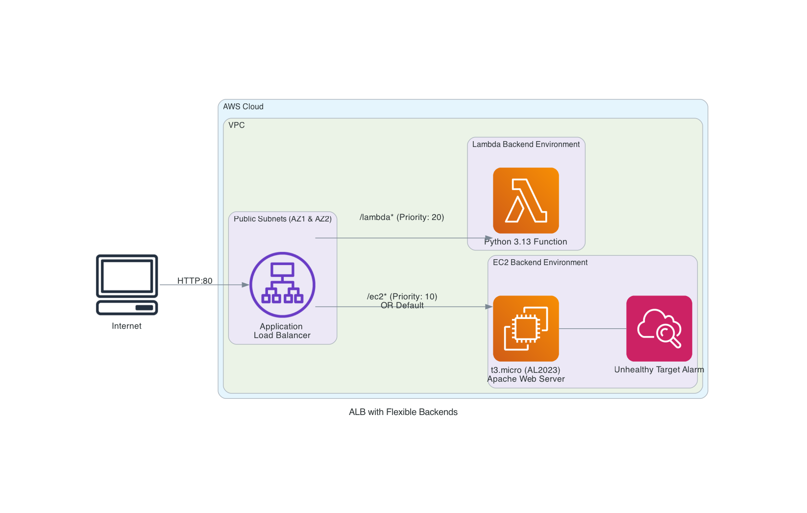

# ALB with Flexible Backend Targets

This CloudFormation template creates an Application Load Balancer (ALB) with flexible backend options: EC2 instances, Lambda functions, or both.

## Features

- **Flexible Backend Configuration**: Choose between EC2-only, Lambda-only, or both backends
- **Latest AWS Resources**:
  - Amazon Linux 2023 (AL2023)
  - t3.micro instance type (free tier eligible)
  - Python 3.13 Lambda runtime (latest supported)
- **Security Best Practices**:
  - Configurable CIDR block access control
  - Security groups with least privilege
  - IMDSv2 for EC2 metadata
  - SSM Session Manager for secure EC2 access (no SSH keys needed)
  - Drop invalid HTTP headers on ALB
- **Monitoring**: CloudWatch alarm for unhealthy targets
- **Comprehensive Outputs**: All important resource identifiers and URLs

## Architecture



### EC2 Only Mode

```text
Internet → ALB → EC2 Instance (t3.micro, AL2023, Apache)
```

### Lambda Only Mode

```text
Internet → ALB → Lambda Function (Python 3.13)
```

### EC2 + Lambda Mode

```text
Internet → ALB → /ec2*   → EC2 Instance
              → /lambda* → Lambda Function
              → /        → EC2 Instance (default)
```

## Parameters

| Parameter | Description | Default | Required |
|-----------|-------------|---------|----------|
| `VpcId` | VPC ID where resources will be deployed | - | Yes |
| `PublicSubnet1` | Public subnet in first AZ for ALB | - | Yes |
| `PublicSubnet2` | Public subnet in second AZ for ALB | - | Yes |
| `BackendType` | Backend configuration | `EC2AndLambda` | No |
| `AllowedCidrBlock` | CIDR block allowed to access ALB | `0.0.0.0/0` | No |
| `LatestAL2023AmiId` | Latest AL2023 AMI (auto-resolved) | SSM Parameter | No |

### Backend Type Options

- **EC2Only**: Creates only EC2 instance and target group
- **LambdaOnly**: Creates only Lambda function and target group
- **EC2AndLambda**: Creates both backends with path-based routing

## Deployment

### Prerequisites

- AWS CLI configured with appropriate credentials
- Existing VPC with two public subnets in different AZs
- Subnets must have internet gateway route for ALB
- (Optional) `cfn-lint` for template linting: `pip install cfn-lint`
- (Optional) `make` for using the Makefile

### Quick Start with Makefile (Recommended)

The easiest way to manage the stack is using the included Makefile:

```bash
# View all available commands and options
make help

# Validate and lint the template
make validate lint

# Create stack with default parameters
make create

# Create stack with custom name and parameters
make create stack-name=prod-alb parameter-file=prod-params.json

# Wait for creation to complete and show outputs
make wait-create stack-name=prod-alb

# Test all endpoints
make test stack-name=prod-alb

# Update existing stack
make update stack-name=prod-alb

# Delete stack
make delete stack-name=prod-alb

# Full deployment workflow (validate, create, wait, test)
make deploy

# Full update workflow (validate, update, wait, test)
make redeploy
```

### Deploy via AWS CLI

```bash
# Get your VPC and subnet IDs
VPC_ID="vpc-xxxxxxxxx"
SUBNET1="subnet-xxxxxxxxx"
SUBNET2="subnet-yyyyyyyyy"

# Deploy with both backends (default)
aws cloudformation create-stack \
  --stack-name my-alb-stack \
  --template-body file://template.cfn.yaml \
  --parameters \
    ParameterKey=VpcId,ParameterValue=$VPC_ID \
    ParameterKey=PublicSubnet1,ParameterValue=$SUBNET1 \
    ParameterKey=PublicSubnet2,ParameterValue=$SUBNET2 \
    ParameterKey=BackendType,ParameterValue=EC2AndLambda \
    ParameterKey=AllowedCidrBlock,ParameterValue=0.0.0.0/0 \
  --capabilities CAPABILITY_NAMED_IAM

# Deploy with EC2 only
aws cloudformation create-stack \
  --stack-name my-alb-ec2-stack \
  --template-body file://template.cfn.yaml \
  --parameters \
    ParameterKey=VpcId,ParameterValue=$VPC_ID \
    ParameterKey=PublicSubnet1,ParameterValue=$SUBNET1 \
    ParameterKey=PublicSubnet2,ParameterValue=$SUBNET2 \
    ParameterKey=BackendType,ParameterValue=EC2Only \
  --capabilities CAPABILITY_NAMED_IAM

# Deploy with Lambda only
aws cloudformation create-stack \
  --stack-name my-alb-lambda-stack \
  --template-body file://template.cfn.yaml \
  --parameters \
    ParameterKey=VpcId,ParameterValue=$VPC_ID \
    ParameterKey=PublicSubnet1,ParameterValue=$SUBNET1 \
    ParameterKey=PublicSubnet2,ParameterValue=$SUBNET2 \
    ParameterKey=BackendType,ParameterValue=LambdaOnly \
  --capabilities CAPABILITY_NAMED_IAM

# Restrict access to specific CIDR
aws cloudformation create-stack \
  --stack-name my-alb-private-stack \
  --template-body file://template.cfn.yaml \
  --parameters \
    ParameterKey=VpcId,ParameterValue=$VPC_ID \
    ParameterKey=PublicSubnet1,ParameterValue=$SUBNET1 \
    ParameterKey=PublicSubnet2,ParameterValue=$SUBNET2 \
    ParameterKey=AllowedCidrBlock,ParameterValue=10.0.0.0/8 \
  --capabilities CAPABILITY_NAMED_IAM
```

### Deploy via AWS Console

1. Navigate to CloudFormation in AWS Console
2. Click "Create stack" → "With new resources"
3. Upload `template.cfn.yaml`
4. Fill in parameters:
   - Stack name
   - VPC ID
   - Two public subnet IDs
   - Backend type (optional)
   - Allowed CIDR block (optional)
5. Acknowledge IAM resource creation
6. Click "Create stack"

## Testing

### Using Makefile

```bash
# Run all tests (automatically detects backend type)
make test stack-name=my-alb-stack

# Test specific endpoints
make test-ec2 stack-name=my-alb-stack
make test-lambda stack-name=my-alb-stack
make test-health stack-name=my-alb-stack

# View stack outputs
make outputs stack-name=my-alb-stack

# Monitor stack events
make events stack-name=my-alb-stack

# View Lambda logs (if Lambda backend)
make logs stack-name=my-alb-stack
```

### Manual Testing

#### Get ALB DNS Name

```bash
aws cloudformation describe-stacks \
  --stack-name my-alb-stack \
  --query 'Stacks[0].Outputs[?OutputKey==`LoadBalancerDNS`].OutputValue' \
  --output text
```

### Test Endpoints

```bash
# Get the ALB URL
ALB_URL=$(aws cloudformation describe-stacks \
  --stack-name my-alb-stack \
  --query 'Stacks[0].Outputs[?OutputKey==`LoadBalancerURL`].OutputValue' \
  --output text)

# Test default endpoint (EC2 in EC2AndLambda mode)
curl $ALB_URL

# Test EC2 endpoint (EC2AndLambda mode only)
curl $ALB_URL/ec2

# Test Lambda endpoint (EC2AndLambda mode only)
curl $ALB_URL/lambda

# Test health check (EC2 backends)
curl $ALB_URL/health
```

## Outputs

| Output | Description |
|--------|-------------|
| `LoadBalancerDNS` | DNS name of the ALB |
| `LoadBalancerURL` | Full HTTP URL to access the ALB |
| `LoadBalancerArn` | ARN of the ALB |
| `ALBSecurityGroupId` | Security group ID for the ALB |
| `BackendConfiguration` | Current backend type |
| `EC2InstanceId` | EC2 instance ID (if created) |
| `EC2TargetGroupArn` | EC2 target group ARN (if created) |
| `EC2AccessPath` | Path to access EC2 backend (both mode) |
| `LambdaFunctionArn` | Lambda function ARN (if created) |
| `LambdaTargetGroupArn` | Lambda target group ARN (if created) |
| `LambdaAccessPath` | Path to access Lambda backend (both mode) |
| `UsageInstructions` | How to access your application |

## Makefile Features

The included Makefile provides a comprehensive set of commands for managing the CloudFormation stack:

### Validation & Linting

- `make validate` - Validate template syntax with AWS CloudFormation
- `make lint` - Run cfn-lint for best practices (requires cfn-lint)

### Stack Management

- `make create` - Create a new stack
- `make update` - Update an existing stack
- `make delete` - Delete stack with confirmation prompt
- `make status` - Show current stack status
- `make describe` - Show detailed stack information

### Stack Information

- `make outputs` - Display all stack outputs
- `make events` - Show recent stack events
- `make logs` - Show Lambda function logs

### Testing

- `make test` - Run all tests (auto-detects backend type)
- `make test-ec2` - Test EC2 backend endpoint
- `make test-lambda` - Test Lambda backend endpoint
- `make test-health` - Test health check endpoint

### Wait Operations

- `make wait-create` - Wait for stack creation to complete
- `make wait-update` - Wait for stack update to complete
- `make wait-delete` - Wait for stack deletion to complete

### Combined Workflows

- `make deploy` - Full deployment: validate, create, wait, test
- `make redeploy` - Full update: validate, update, wait, test
- `make teardown` - Full deletion: delete and wait

### Makefile Arguments

All Makefile targets accept these arguments:

```bash
# Stack name (default: alb-demo)
make create stack-name=my-custom-stack

# Parameter file (default: parameters-example.json)
make create parameter-file=prod-params.json

# AWS region (default: us-east-1)
make create region=us-west-2

# Combine multiple arguments
make create stack-name=prod-alb parameter-file=prod.json region=us-west-2
```

## Security Considerations

### Network Security

- ALB security group allows HTTP (port 80) from specified CIDR only
- EC2 security group allows HTTP only from ALB security group
- EC2 has outbound access for updates and SSM agent

### IAM Permissions

- EC2 instance role has `AmazonSSMManagedInstanceCore` for Session Manager
- Lambda execution role has `AWSLambdaBasicExecutionRole` for CloudWatch Logs
- No inline policies - uses AWS managed policies only

### Best Practices Implemented

- IMDSv2 enforced for EC2 metadata access
- Drop invalid HTTP headers on ALB
- Health checks configured for EC2 targets
- Deregistration delay for graceful shutdown
- SSM Session Manager instead of SSH keys

## Cost Estimation

### Free Tier Eligible (first 12 months)

- t3.micro EC2 instance: 750 hours/month
- ALB: 750 hours/month + 15 GB data processing
- Lambda: 1M requests/month + 400,000 GB-seconds compute

### Beyond Free Tier (us-east-1 pricing)

- t3.micro: ~$0.0104/hour (~$7.50/month)
- ALB: $0.0225/hour (~$16.20/month) + $0.008/LCU-hour
- Lambda: $0.20/1M requests + $0.0000166667/GB-second
- Data transfer: First 1 GB free, then $0.09/GB

## Troubleshooting

### Stack Creation Fails

1. **Check VPC and Subnets**: Ensure subnets are in different AZs and are public
2. **Check IAM Permissions**: Ensure you have permissions to create IAM roles
3. **Check Service Limits**: Verify you haven't hit EC2 or ALB limits

### Cannot Access ALB

1. **Check Security Group**: Verify `AllowedCidrBlock` includes your IP
2. **Check Target Health**: View target group health in EC2 console
3. **Check Route Tables**: Ensure subnets have internet gateway route

### EC2 Instance Unhealthy

1. **Check Health Endpoint**: SSH or use Session Manager to verify `/var/www/html/health` exists
2. **Check Apache Status**: `systemctl status httpd`
3. **Check Security Group**: Verify ALB can reach EC2 on port 80

### Lambda Not Responding

1. **Check Lambda Logs**: View CloudWatch Logs for errors
2. **Check Permissions**: Verify ALB has permission to invoke Lambda
3. **Check Target Group**: Ensure Lambda is registered in target group

## Cleanup

### Using Makefile

```bash
# Delete stack with confirmation prompt
make delete stack-name=my-alb-stack

# Delete and wait for completion
make teardown stack-name=my-alb-stack
```

### Using AWS CLI

```bash
# Delete the stack
aws cloudformation delete-stack --stack-name my-alb-stack

# Wait for deletion to complete
aws cloudformation wait stack-delete-complete --stack-name my-alb-stack
```

## Customization

### Change Lambda Runtime to Node.js

Replace the Lambda function section with:

```yaml
LambdaFunction:
  Type: 'AWS::Lambda::Function'
  Condition: CreateLambdaResources
  Properties:
    FunctionName: !Sub '${AWS::StackName}-lambda-function'
    Runtime: nodejs20.x  # or nodejs22.x when available
    Handler: index.handler
    Role: !GetAtt LambdaExecutionRole.Arn
    Timeout: 30
    MemorySize: 128
    Code:
      ZipFile: |
        exports.handler = async (event) => {
          const html = `
            <!DOCTYPE html>
            <html>
            <head><title>Lambda Backend</title></head>
            <body>
              <h1>Hello from Node.js Lambda!</h1>
              <p>Request ID: ${event.requestContext.requestId}</p>
            </body>
            </html>
          `;
          
          return {
            statusCode: 200,
            statusDescription: '200 OK',
            headers: { 'Content-Type': 'text/html' },
            body: html
          };
        };
```

### Add HTTPS Support

1. Request or import an ACM certificate
2. Add certificate parameter
3. Update listener to use HTTPS (port 443)
4. Add redirect from HTTP to HTTPS

### Add Auto Scaling

Add an Auto Scaling Group instead of a single EC2 instance for production workloads.

## License

This template is provided as-is for educational and demonstration purposes.

## Support

For issues or questions:

- Check AWS CloudFormation documentation
- Review CloudWatch Logs for Lambda errors
- Use Session Manager to debug EC2 instances
- Check target group health status in EC2 console
