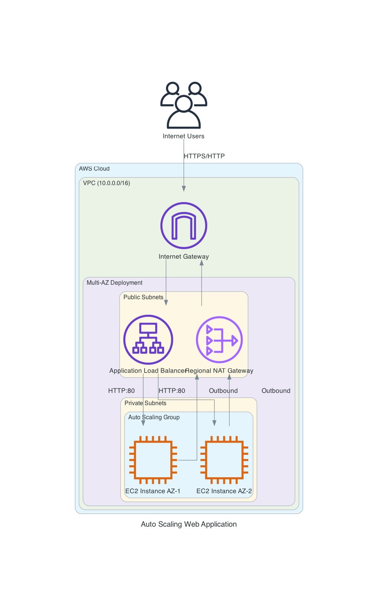

# Auto Scaling Web Application with Application Load Balancer

A production-ready CloudFormation template that deploys a highly available, auto-scaling web application on AWS using modern best practices.

## Architecture Overview

This template creates a complete multi-tier architecture:

- **VPC**: Custom VPC with public and private subnets across 2 Availability Zones
- **Application Load Balancer (ALB)**: Internet-facing load balancer in public subnets
- **Auto Scaling Group**: EC2 instances in private subnets with automatic scaling
- **Regional NAT Gateway**: Single NAT Gateway with automatic multi-AZ expansion
- **Systems Manager**: Session Manager access (no SSH keys required)
- **CloudWatch**: Alarms for automatic scaling based on CPU utilization
- **SNS**: Email notifications for scaling events



## Features

### Modern AWS Best Practices

- **Amazon Linux 2023**: Latest AL2023 AMI automatically selected via SSM Parameter Store
- **Launch Templates**: Uses modern Launch Templates instead of deprecated Launch Configurations
- **Application Load Balancer**: Modern ALBv2 instead of Classic ELB
- **ARM64 Support**: Includes Graviton2/Graviton3 instance types (t4g, m6g, m7g, c6g, c7g, r6g)
- **Session Manager**: Secure instance access without SSH keys or bastion hosts
- **Regional NAT Gateways**: High availability with one NAT Gateway per AZ
- **IMDSv2**: Enforced Instance Metadata Service v2 for enhanced security

### Security

- **No SSH Keys**: Uses AWS Systems Manager Session Manager for secure access
- **Private Subnets**: EC2 instances run in private subnets with no direct internet access
- **Security Groups**: Least-privilege security group rules
- **IAM Roles**: Proper IAM roles with managed policies for SSM and CloudWatch
- **IMDSv2 Required**: Metadata service configured for enhanced security

### High Availability

- **Multi-AZ**: Resources distributed across 2 Availability Zones
- **Auto Scaling**: Automatic scaling based on CPU utilization
- **Health Checks**: ELB health checks with automatic instance replacement
- **Rolling Updates**: Zero-downtime updates with rolling deployment strategy
- **Regional NAT Gateway**: Single NAT Gateway with automatic multi-AZ expansion for redundancy

### Monitoring and Notifications

- **CloudWatch Alarms**: CPU-based alarms trigger scaling actions
- **SNS Notifications**: Email alerts for scaling events
- **Detailed Outputs**: Comprehensive stack outputs for integration

## Prerequisites

- AWS CLI installed and configured
- AWS account with appropriate permissions
- Valid email address for notifications
- (Optional) `cfn-lint` for template linting: `pip install cfn-lint`
- (Optional) `make` for using the Makefile

## Quick Start

### Using the Makefile (Recommended)

1. **Update parameters**:

   ```bash
   # Edit parameters.json with your email address
   vim parameters.json
   ```

2. **Deploy the stack**:

   ```bash
   make deploy
   ```

3. **Wait for completion**:

   ```bash
   make wait-complete
   ```

4. **Get the URL**:

   ```bash
   make get-url
   ```

5. **Open in browser**:

   ```bash
   make open-url
   ```

### Using AWS CLI

1. **Validate the template**:

   ```bash
   aws cloudformation validate-template \
     --template-body file://template.cfn.yaml
   ```

2. **Create the stack**:

   ```bash
   aws cloudformation create-stack \
     --stack-name autoscaling-demo \
     --template-body file://template.cfn.yaml \
     --parameters file://parameters.json \
     --capabilities CAPABILITY_IAM \
     --region us-east-1
   ```

3. **Monitor stack creation**:

   ```bash
   aws cloudformation describe-stack-events \
     --stack-name autoscaling-demo \
     --region us-east-1
   ```

4. **Get outputs**:

   ```bash
   aws cloudformation describe-stacks \
     --stack-name autoscaling-demo \
     --query 'Stacks[0].Outputs' \
     --region us-east-1
   ```

## Parameters

| Parameter | Description | Default | Allowed Values |
|-----------|-------------|---------|----------------|
| `InstanceType` | EC2 instance type | `t3.micro` | See template for full list |
| `InstanceArchitecture` | CPU architecture | `arm64` | `x86_64`, `arm64` |
| `MinSize` | Minimum instances | `1` | 1-10 |
| `MaxSize` | Maximum instances | `3` | 1-10 |
| `DesiredCapacity` | Desired instances | `2` | 1-10 |
| `OperatorEmail` | Notification email | - | Valid email address |

### Supported Instance Types

#### ARM64 (Graviton) - Recommended for cost savings

- **T4g**: t4g.nano, t4g.micro, t4g.small, t4g.medium, t4g.large, t4g.xlarge, t4g.2xlarge
- **M6g**: m6g.medium, m6g.large, m6g.xlarge, m6g.2xlarge
- **M7g**: m7g.medium, m7g.large, m7g.xlarge
- **C6g**: c6g.medium, c6g.large, c6g.xlarge
- **C7g**: c7g.medium, c7g.large, c7g.xlarge
- **R6g**: r6g.medium, r6g.large, r6g.xlarge

#### x86_64 (Intel/AMD)

- **T3**: t3.nano, t3.micro, t3.small, t3.medium, t3.large, t3.xlarge, t3.2xlarge
- **M5**: m5.large, m5.xlarge, m5.2xlarge, m5.4xlarge
- **M6i**: m6i.large, m6i.xlarge, m6i.2xlarge
- **C5**: c5.large, c5.xlarge, c5.2xlarge
- **R5**: r5.large, r5.xlarge, r5.2xlarge

## Makefile Commands

The included Makefile provides convenient commands for managing the stack:

### Essential Commands

```bash
make help              # Show all available commands
make deploy            # Deploy stack (create or update)
make delete            # Delete the stack
make status            # Show current stack status
make outputs           # Show stack outputs
make get-url           # Get the ALB URL
make open-url          # Open the ALB URL in browser
```

### Validation and Testing

```bash
make validate          # Validate template syntax
make lint              # Run cfn-lint (requires cfn-lint)
make test              # Run all validation tests
```

### Stack Information

```bash
make describe          # Detailed stack information
make events            # Recent stack events
make resources         # List all stack resources
make parameters        # Show stack parameters
```

### Advanced Commands

```bash
make change-set        # Create a change set to preview changes
make wait-complete     # Wait for stack operation to complete
make wait-delete       # Wait for stack deletion
make list-stacks       # List all stacks in region
make tail-events       # Continuously tail events (requires watch)
```

### Custom Variables

Override default values:

```bash
make deploy STACK_NAME=my-stack REGION=us-west-2
make delete STACK_NAME=my-stack
make status STACK_NAME=my-stack REGION=eu-west-1
```

## Outputs

The stack provides the following outputs:

| Output | Description |
|--------|-------------|
| `LoadBalancerURL` | HTTP URL of the Application Load Balancer |
| `LoadBalancerDNS` | DNS name of the ALB |
| `VPCId` | VPC ID |
| `PublicSubnets` | Public subnet IDs (comma-separated) |
| `PrivateSubnets` | Private subnet IDs (comma-separated) |
| `AutoScalingGroupName` | Auto Scaling Group name |
| `TargetGroupARN` | ALB Target Group ARN |
| `InstanceSecurityGroupId` | EC2 instance security group ID |
| `ALBSecurityGroupId` | ALB security group ID |
| `NotificationTopicARN` | SNS topic ARN |
| `LaunchTemplateId` | Launch Template ID |
| `LaunchTemplateVersion` | Launch Template version |

## Accessing EC2 Instances

This template uses AWS Systems Manager Session Manager for secure instance access without SSH keys.

### Using AWS Console

1. Navigate to **EC2 Console** → **Instances**
2. Select an instance
3. Click **Connect** → **Session Manager** → **Connect**

### Using AWS CLI

```bash
# List instances in the Auto Scaling Group
aws autoscaling describe-auto-scaling-groups \
  --auto-scaling-group-names autoscaling-demo-asg \
  --query 'AutoScalingGroups[0].Instances[*].[InstanceId,HealthStatus]' \
  --output table

# Start a session
aws ssm start-session --target i-1234567890abcdef0
```

### Using Session Manager Plugin

Install the Session Manager plugin and use:

```bash
aws ssm start-session --target <instance-id>
```

## Auto Scaling Behavior

### Scale Up

- **Trigger**: CPU utilization > 70% for 5 minutes
- **Action**: Add 1 instance
- **Cooldown**: 60 seconds

### Scale Down

- **Trigger**: CPU utilization < 30% for 10 minutes
- **Action**: Remove 1 instance
- **Cooldown**: 300 seconds (5 minutes)

### Testing Auto Scaling

To test scaling, SSH into an instance and generate CPU load:

```bash
# Connect via Session Manager
aws ssm start-session --target <instance-id>

# Generate CPU load
stress-ng --cpu 2 --timeout 600s
# Or if stress-ng is not available:
yes > /dev/null &
yes > /dev/null &
```

Monitor scaling in CloudWatch or via CLI:

```bash
make events
# or
aws cloudformation describe-stack-events --stack-name autoscaling-demo
```

## Cost Estimation

### Approximate Monthly Costs (us-east-1)

Based on 2 instances running 24/7:

| Resource | Cost (USD/month) |
|----------|------------------|
| 2x t4g.micro instances | ~$12 |
| Application Load Balancer | ~$16 |
| Regional NAT Gateway | ~$32 |
| Data transfer (estimated) | ~$10 |
| **Total** | **~$70/month** |

**Cost Optimization Tips**:

- Use ARM64 instances (Graviton) for 20% cost savings
- Regional NAT Gateway provides automatic multi-AZ redundancy at lower cost than multiple zonal NAT Gateways
- Use smaller instance types for low-traffic applications
- Enable ALB access logs only when needed

## Troubleshooting

### Stack Creation Fails

1. **Check events**:

   ```bash
   make events
   ```

2. **Common issues**:
   - Invalid email address format
   - Insufficient IAM permissions
   - Service limits exceeded
   - Invalid instance type for region

### Instances Not Healthy

1. **Check target group health**:

   ```bash
   aws elbv2 describe-target-health \
     --target-group-arn <target-group-arn>
   ```

2. **Check instance logs**:

   ```bash
   # Connect via Session Manager
   aws ssm start-session --target <instance-id>
   
   # Check Apache logs
   sudo tail -f /var/log/httpd/error_log
   
   # Check cloud-init logs
   sudo tail -f /var/log/cloud-init-output.log
   ```

### Cannot Access Application

1. **Verify ALB DNS**:

   ```bash
   make get-url
   ```

2. **Check security groups**:

   ```bash
   make resources
   ```

3. **Verify target health**:

   ```bash
   aws elbv2 describe-target-health \
     --target-group-arn $(make outputs | grep TargetGroupARN)
   ```

## Updating the Stack

### Update Parameters Only

1. Edit `parameters.json`
2. Run:

   ```bash
   make update
   ```

### Update Template

1. Modify `template.cfn.yaml`
2. Validate:

   ```bash
   make validate
   ```

3. Preview changes:

   ```bash
   make change-set
   ```

4. Apply update:

   ```bash
   make update
   ```

### Rolling Updates

The stack is configured for zero-downtime rolling updates:

- Minimum 1 instance stays in service
- Maximum 2 instances updated at a time
- 15-minute timeout for each batch
- Waits for health checks before proceeding

## Cleanup

### Delete the Stack

```bash
make delete
```

Or with AWS CLI:

```bash
aws cloudformation delete-stack --stack-name autoscaling-demo
```

### Verify Deletion

```bash
make wait-delete
```

**Note**: NAT Gateway Elastic IPs may take a few minutes to release.

## Security Considerations

### Network Security

- EC2 instances in private subnets (no direct internet access)
- ALB in public subnets (internet-facing)
- Security groups follow least-privilege principle
- No SSH access (Session Manager only)

### IAM Security

- Instance role with minimal required permissions
- Managed policies for SSM and CloudWatch
- No hardcoded credentials

### Data Security

- IMDSv2 enforced (prevents SSRF attacks)
- HTTPS recommended for production (add ACM certificate)
- Enable ALB access logs for audit trail

## Production Recommendations

### Before Going to Production

1. **Enable HTTPS**:
   - Request ACM certificate
   - Add HTTPS listener to ALB
   - Redirect HTTP to HTTPS

2. **Enable Logging**:
   - ALB access logs to S3
   - CloudWatch Logs for application logs
   - VPC Flow Logs for network analysis

3. **Enhance Monitoring**:
   - CloudWatch Dashboard
   - Additional CloudWatch alarms
   - AWS X-Ray for tracing

4. **Backup and DR**:
   - Enable automated snapshots
   - Multi-region deployment
   - Disaster recovery plan

5. **Cost Optimization**:
   - Reserved Instances or Savings Plans
   - Right-size instances based on metrics
   - Consider Spot Instances for non-critical workloads

## Additional Resources

- [AWS CloudFormation Documentation](https://docs.aws.amazon.com/cloudformation/)
- [Amazon EC2 Auto Scaling](https://docs.aws.amazon.com/autoscaling/ec2/)
- [Application Load Balancer](https://docs.aws.amazon.com/elasticloadbalancing/latest/application/)
- [AWS Systems Manager Session Manager](https://docs.aws.amazon.com/systems-manager/latest/userguide/session-manager.html)
- [Amazon Linux 2023](https://docs.aws.amazon.com/linux/al2023/)

## License

Apache-2.0

## Contributing

Contributions are welcome! Please feel free to submit issues or pull requests.

## Support

For issues or questions:

1. Check the troubleshooting section
2. Review CloudFormation events: `make events`
3. Check AWS CloudFormation documentation
4. Open an issue in the repository
